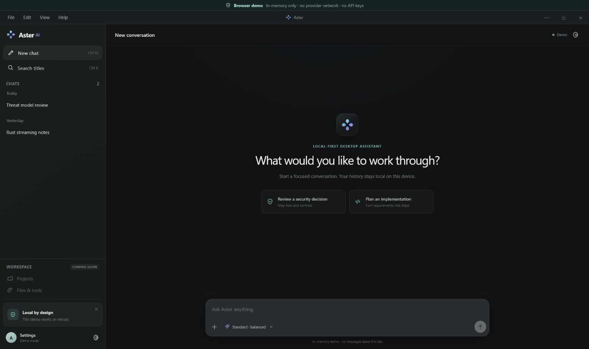

<p align="center">
  
</p>

<h1 align="center">Aster Desktop</h1>

<p align="center">
  A security-focused, local-first Windows 11 client for direct conversations with the official Z.AI chat API.
</p>

Aster combines a native Tauri shell, a React and TypeScript interface, a Rust trust boundary, Windows Credential Manager, and local SQLite conversation history.

> **Project status:** `v0.1.0` is an unsigned MVP v1 engineering implementation for local evaluation. It is not a signed production release, and the complete clean-profile Windows acceptance campaign remains outstanding. Revision-specific results must follow the [evidence policy](docs/evidence/README.md) and report exact `PASS`, `FAIL`, and `NOT RUN` outcomes.

## MVP v1 preview

<p align="center">
  
</p>

<p align="center">
  <em>Aster Desktop MVP v1 browser demo. This preview demonstrates the interface only; it is not evidence of native Windows, provider, persistence, credential-storage, packaging, or signing behavior.</em>
</p>

## Highlights

- Streamed `glm-5.1` responses with ordered deltas and real Rust-side cancellation.
- Local conversation creation, search, rename, deletion, edit/resend, and regeneration.
- Rust-owned native API-key capture; the credential value never enters the React webview or application IPC.
- User-scoped SQLite history with transactional repository behavior.
- Safe Markdown and code rendering without an application HTML sink.
- Versioned, bounded conversation import and plaintext JSON export through native dialogs.
- Three honest application response profiles: Fast, Standard, and Deep.
- Restrictive Content Security Policy, explicit Tauri commands, and least-privilege capabilities.
- Specification, threat model, architecture decisions, acceptance criteria, CI, dependency audits, and CycloneDX SBOM generation.

## MVP boundary

| Included in MVP v1          | Intentionally deferred               |
| --------------------------- | ------------------------------------ |
| Direct Z.AI chat            | Projects and workspaces              |
| Streaming and stop          | File/document attachments            |
| Local conversation history  | Shell or arbitrary command execution |
| Edit and regenerate         | Model-invoked tools                  |
| Safe Markdown and code copy | RAG and vector search                |
| Native credential setup     | Voice input/output                   |
| Import and export           | Automatic updates                    |

Deferred entries are disabled or labelled unavailable. No hidden backend capability is provided for them.

## Security architecture

```text
React webview
    │ typed, bounded Tauri commands and ordered events
    ▼
Rust application boundary
    ├── Windows Credential Manager (API key)
    ├── SQLite (local conversations)
    ├── native import/export dialogs
    └── fixed HTTPS origin → Z.AI chat API
```

Core guarantees:

- React cannot call Z.AI directly and never receives the API key.
- Rust validates application IPC, imported data, persistence transitions, external links, provider streams, and cancellation.
- Provider traffic uses the fixed documented HTTPS origin with normal platform certificate validation.
- Raw HTML, remote active content, wildcard Tauri permissions, shell access, and arbitrary filesystem access are prohibited.
- Browser demo mode is visibly isolated, credential-free, in-memory, and unsuitable as desktop security evidence.

Read [AGENTS.md](AGENTS.md), the [architecture](docs/architecture.md), and the [security requirements](docs/security-requirements.md) before changing a trust boundary.

## Response profiles

| Profile  | Provider thinking | Output-token cap | Intended use                           |
| -------- | ----------------- | ---------------: | -------------------------------------- |
| Fast     | Disabled          |            4,096 | Short, direct answers                  |
| Standard | Enabled           |            8,192 | General-purpose conversations          |
| Deep     | Enabled           |           16,384 | Longer responses with more output room |

Standard and Deep are application profiles, not different provider reasoning-effort levels. The accepted provider contract is pinned to `glm-5.1`; changing models requires a specification, privacy, architecture, threat-model, and contract-test update.

## Prerequisites

- Windows 11 x64 with Microsoft Edge WebView2 Runtime.
- Node.js 22.12 or newer.
- pnpm 10 or newer; the repository declares pnpm 11.7.0.
- Rust 1.97.0 with the `x86_64-pc-windows-msvc` target.
- Microsoft Visual Studio 2022 Build Tools with the Desktop development with C++ workload.

See the [development guide](docs/development.md) for fresh-laptop setup and tool verification.

## Quick start

Clone the private repository with an authenticated GitHub account:

```powershell
gh repo clone renenehru/aster-desktop
Set-Location aster-desktop
```

Install the exact locked dependencies:

```powershell
pnpm install --frozen-lockfile
```

Run the credential-free browser demo for UI work:

```powershell
pnpm dev
```

Run the Windows desktop application:

```powershell
pnpm desktop:dev
```

In the desktop app, open **Settings**, select **Add API key**, and complete the Rust-owned native Windows prompt. Review the external-processing disclosure before sending content to Z.AI.

## Verification

Run the complete local verification orchestrator from a Visual Studio developer environment:

```powershell
powershell -ExecutionPolicy Bypass -File scripts/verify.ps1
```

Useful focused commands:

```powershell
pnpm check
pnpm test:coverage
pnpm audit:frontend
pnpm audit:rust
pnpm security:secrets
pnpm security:config
```

The scope of each command is documented in [docs/testing.md](docs/testing.md). A passing unit test, browser preview, or screenshot must not be promoted into evidence for Windows credential storage, native IPC, packaged persistence, provider TLS, installer behavior, or signing.

## Build

Create an unsigned Windows engineering build:

```powershell
powershell -ExecutionPolicy Bypass -File scripts/build-engineering.ps1
powershell -ExecutionPolicy Bypass -File scripts/package-audit.ps1
```

The build script remaps local Rust and native dependency paths before producing the Tauri executable and NSIS bundle. Unsigned artifacts are engineering outputs only. The [release process](docs/release-process.md) defines the additional evidence and signing requirements for production.

## Documentation

Start with the [documentation index](docs/README.md).

| Area              | Document                                                                                          |
| ----------------- | ------------------------------------------------------------------------------------------------- |
| Product contract  | [Product specification](docs/product-spec.md)                                                     |
| Architecture      | [Architecture and trust boundaries](docs/architecture.md)                                         |
| Security          | [Security requirements](docs/security-requirements.md) and [threat model](docs/threat-model.md)   |
| Verification      | [Acceptance criteria](docs/acceptance-criteria.md) and [evidence policy](docs/evidence/README.md) |
| External API      | [Verified provider contract](docs/provider-contract.md)                                           |
| Decisions         | [Architecture decision records](docs/decisions/README.md)                                         |
| Contributor setup | [Development guide](docs/development.md)                                                          |
| GitHub teamwork   | [Collaboration workflow](docs/collaboration-workflow.md)                                          |
| Tests             | [Testing guide](docs/testing.md)                                                                  |
| Releases          | [Release process](docs/release-process.md)                                                        |
| Support           | [Troubleshooting](docs/troubleshooting.md) and [support policy](SUPPORT.md)                       |
| Future work       | [Roadmap](docs/roadmap.md)                                                                        |

## Collaboration

Read [CONTRIBUTING.md](CONTRIBUTING.md), [GOVERNANCE.md](GOVERNANCE.md), and [CODE_OF_CONDUCT.md](CODE_OF_CONDUCT.md) before opening a change. Every behavior-changing pull request starts with stable requirement IDs, updates the threat model when a boundary changes, and records verification evidence with honest scope.

Security vulnerabilities must be reported through a private channel described in [SECURITY.md](SECURITY.md), never through a public issue with exploit details or sensitive data.

## Privacy

Conversation content is stored locally in user-scoped SQLite without application-level database encryption. Explicit exports are plaintext JSON and must be handled as sensitive files. Content sent by the user is processed by Z.AI under the provider's current terms and retention policy.

Never commit API keys, conversation exports, user databases, signing material, or private evidence. The repository secret scan is a release gate, not a replacement for credential hygiene.

## Licensing status

No open-source license has been selected for this repository. Keep the repository private and do not redistribute the source or binaries until the project owner makes and records a licensing decision.
