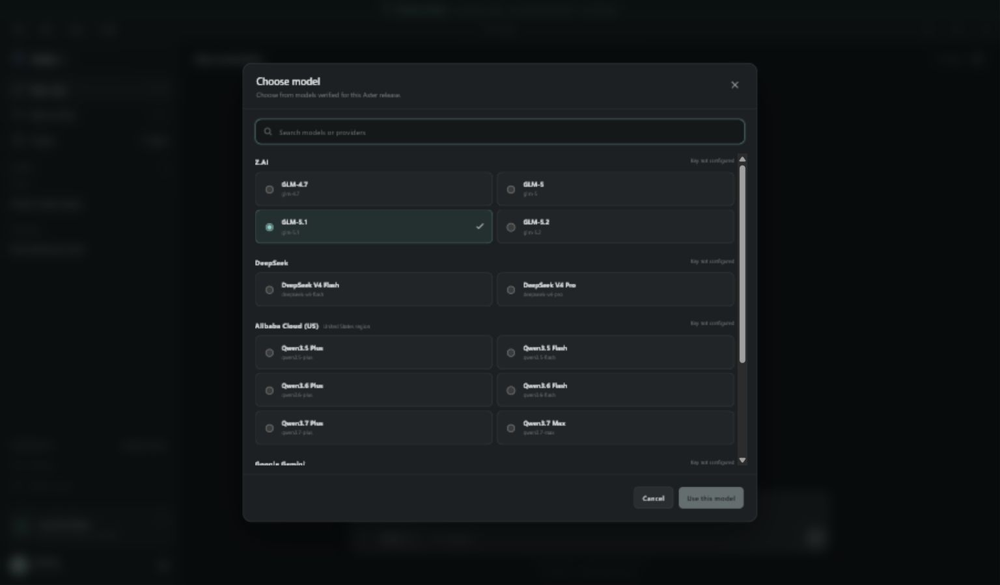

<p align="center">
  
</p>

<h1 align="center">Aster Desktop</h1>

<p align="center">
  A security-focused, local-first Windows 11 chat client for a curated catalog of official AI provider APIs.
</p>

Aster combines a Tauri desktop shell, React and TypeScript presentation layer,
Rust trust boundary, provider-scoped Windows credentials, and local SQLite
conversation history. The renderer never receives an API key or chooses a
network endpoint.

> **Project status:** `v0.2.0` specifies the MVP v2 multi-provider engineering
> implementation. Current artifacts are unsigned engineering builds for local
> evaluation, not signed production releases. Live-provider compatibility,
> clean-profile Windows acceptance, package inventory, and signing must be
> reported only through revision-specific evidence with exact `PASS`, `FAIL`,
> and `NOT RUN` outcomes.

## Choose MVP v1 or MVP v2

MVP v1 and MVP v2 are public engineering source baselines, not two signed
installer releases. MVP v1 is the historical Z.AI `glm-5.1` implementation;
MVP v2 is the current development line with 5 providers, 17 exact model
identifiers, provider-scoped credentials, and local Usage/account workflows.

| Baseline         | Best fit                                                                       | Public source                                                                                                          |
| ---------------- | ------------------------------------------------------------------------------ | ---------------------------------------------------------------------------------------------------------------------- |
| MVP v1 (`0.1.0`) | A deliberately minimal Z.AI `glm-5.1` reference or specialized historical fork | [Apache-2.0 source snapshot](https://github.com/renenehru/aster-desktop/tree/39c6cc74f6115b4ba68b474648f8314d8be9f03e) |
| MVP v2 (`0.2.0`) | New Aster development and curated multi-provider projects                      | [MVP v2 pull request](https://github.com/renenehru/aster-desktop/pull/10)                                              |

Read the [MVP v1 versus MVP v2 selection guide](docs/version-selection.md)
before choosing a checkout. It includes an exact capability matrix,
commit-pinned source links and archives, migration and downgrade constraints, developer impact,
support status, licensing obligations, and cases where neither version is an
appropriate foundation. The repository currently publishes source only; it has
no GitHub Release or production binary.

## Interface preview

<p align="center">
  
</p>

<p align="center">
  <em>Current MVP v2 browser-demo preview of the closed 17-model catalog. It is visual evidence only and does not establish native Windows behavior, provider networking, persistence, credential storage, packaging, or signing.</em>
</p>

## MVP v2 highlights

- Closed Rust-owned catalog of 5 providers and 17 exact model identifiers.
- Direct provider requests from Rust; React cannot perform provider networking.
- Separate Rust-owned native credential prompt and Windows Credential Manager
  target for each provider.
- Provider and model fixed after the first message in a conversation; changing
  either starts a new chat.
- Fast, Standard, and Deep response profiles mapped only where the dated
  provider contract verifies the exact model behavior.
- Local seven-day token Usage view with input, cached input, output, and total
  accounting, coverage disclosure, and an optional per-provider advisory budget.
- Accessible red warning with text and icon when configured budget remaining is
  at or below 10%.
- Explicit, read-only DeepSeek balance refresh; balances are not stored.
- Fixed provider account actions opened in the operating system's default
  browser. Aster does not buy credits or change plans.
- Local conversation lifecycle, safe Markdown, cancellation, edit/regenerate,
  bounded import, and plaintext export through native dialogs.
- Restrictive CSP and Tauri capabilities, security tests, dependency audits,
  license policy checks, and CycloneDX SBOM generation.

## Verified catalog

Only the provider/model pairs below are included. The catalog has no custom
endpoint, model discovery, or arbitrary model field. Exact contracts and dated
official sources are recorded in
[docs/provider-contract.md](docs/provider-contract.md).

| Provider           | Exact model identifiers                                                                         | Delivery boundary                 |
| ------------------ | ----------------------------------------------------------------------------------------------- | --------------------------------- |
| Z.AI               | `glm-4.7`, `glm-5`, `glm-5.1`, `glm-5.2`                                                        | Official Z.AI API                 |
| DeepSeek           | `deepseek-v4-flash`, `deepseek-v4-pro`                                                          | Official DeepSeek API             |
| Alibaba Cloud (US) | `qwen3.5-plus`, `qwen3.5-flash`, `qwen3.6-plus`, `qwen3.6-flash`, `qwen3.7-plus`, `qwen3.7-max` | Fixed US-region Alibaba Cloud API |
| Google Gemini      | `gemini-2.5-flash`, `gemini-2.5-flash-lite`, `gemini-2.5-pro`                                   | Official Gemini API               |
| NVIDIA             | `nvidia/nemotron-3-super-120b-a12b`, `nvidia/nemotron-3-ultra-550b-a55b`                        | NVIDIA-hosted prototype endpoints |

Alibaba content crosses a fixed US-region boundary, which Aster discloses before
the first send. NVIDIA entries are hosted prototypes for evaluation and must not
be described as production deployments.

## Product boundary

| Included in MVP v2                      | Outside MVP v2                           |
| --------------------------------------- | ---------------------------------------- |
| Curated direct multi-provider chat      | User-defined providers or endpoints      |
| Streaming and explicit cancellation     | Automatic provider request retries       |
| Local conversations and token Usage     | Provider billing or purchase automation  |
| Native provider-scoped credential setup | Browser, environment, or IPC key entry   |
| Explicit DeepSeek balance refresh       | Balance polling for other providers      |
| Safe Markdown and code copy             | Model-invoked tools or shell execution   |
| Bounded native-dialog import/export     | Attachments, RAG, and unrestricted files |
| Browser-demo UI workflow                | Desktop/security evidence from the demo  |

The interface does not list unverified model names. No hidden backend capability
is provided for deferred features.

## Security architecture

```text
React webview
    | typed, bounded Tauri commands and ordered events; no secrets or URLs
    v
Rust application boundary
    +-- provider catalog and model/profile validation
    +-- provider-scoped Windows Credential Manager targets
    +-- SQLite conversations and advisory usage ledger
    +-- native import/export dialogs
    +-- fixed account actions -> operating-system default browser
    +-- exact HTTPS adapters -> official provider-hosted APIs
```

Core guarantees:

- React cannot call an AI provider and never receives a provider API key.
- Rust validates IPC, provider/model/profile combinations, persistence
  transitions, imported data, provider streams, usage metadata, and cancellation.
- Credentials, origins, request mappings, and account URLs are selected from
  fixed Rust-owned policy; no renderer or imported value can override them.
- Normal platform TLS validation is mandatory. Raw HTML, remote active content,
  wildcard permissions, shell access, and arbitrary filesystem access are
  prohibited.
- Provider requests receive no automatic retry. A retry is a new explicit user
  operation because the earlier attempt may already have consumed tokens.
- Browser demo mode is visibly isolated, credential-free, in-memory, and
  unsuitable as native or security evidence.

Read [AGENTS.md](AGENTS.md), the
[architecture](docs/architecture.md), and the
[security requirements](docs/security-requirements.md) before changing a trust
boundary.

## Response profiles and conversation lock

Fast, Standard, and Deep are Aster-owned profiles, not universal reasoning
levels. Rust applies the model-specific request mapping and output-token cap
recorded in the verified provider contract. A profile is disabled when its exact
mapping is unsupported; Aster does not silently drop a field or substitute a
model.

An empty conversation may change its provider/model selection. After its first
message is persisted, that pair is immutable for send, edit, resend,
regenerate, credentials, usage, and stream events. Selecting another pair starts
a new conversation so context never crosses provider boundaries silently.

## Usage and provider accounts

Usage is a local advisory view over the trailing seven days. Validated provider
metadata is normalized as non-cached input, cached input, output, and total
tokens. Missing metadata remains visibly partial. An optional weekly token
budget is stored per provider; it does not block requests and is not a billing
or credit value. At 10% remaining or below, Aster displays a red warning plus
explicit status text and an icon.

DeepSeek is the only MVP v2 provider with an explicit read-only balance refresh.
The response is held only for the current application session. For usage,
billing, credit, spending, or deployment management, Aster passes a typed
provider/action pair to Rust. Rust selects a fixed official HTTPS page and opens
it in the default browser. Aster never embeds account pages, purchases credits,
or changes a plan.

## Prerequisites

- Windows 11 x64 with Microsoft Edge WebView2 Runtime.
- Node.js 22.12 or newer.
- pnpm 10 or newer; `package.json` declares pnpm 11.7.0.
- Rust 1.97.0 with `rustfmt`, Clippy, and the
  `x86_64-pc-windows-msvc` target.
- Microsoft Visual Studio 2022 Build Tools with the **Desktop development with
  C++** workload.

See the [development guide](docs/development.md) for a fresh-laptop setup and
tool verification.

## Quick start

Clone the repository on each development laptop:

```powershell
git clone https://github.com/renenehru/aster-desktop.git
Set-Location aster-desktop
pnpm install --frozen-lockfile
```

Run the credential-free browser demo for UI work:

```powershell
pnpm dev
```

Run the Windows desktop application:

```powershell
pnpm desktop:dev
```

In the desktop app, open **Settings**, choose a provider, and use its **Add API
key** action. Enter the key only in the Rust-owned native Windows prompt. Review
the provider-specific external-processing disclosure before sending content.

Existing MVP v1 databases migrate transactionally to schema v2. Historical
conversations retain `zai` / `glm-5.1`; legacy total-token values remain totals
with an incomplete breakdown. Back up valuable data before testing a migration,
and never delete a database to conceal a migration failure.

## Verification

Run the complete local verification orchestrator from a Visual Studio developer
environment:

```powershell
powershell -ExecutionPolicy Bypass -File scripts/verify.ps1
```

Useful focused commands:

```powershell
pnpm check
pnpm test:coverage
pnpm audit:frontend
pnpm audit:rust
pnpm security:secrets
pnpm security:config
```

The scope of each command is documented in
[docs/testing.md](docs/testing.md). A passing unit test, browser preview, or
screenshot cannot be promoted into evidence for Windows credential storage,
native IPC, packaged SQLite migration, provider TLS, installer behavior, live
provider compatibility, or signing.

## Build classification

Create an unsigned Windows engineering build:

```powershell
powershell -ExecutionPolicy Bypass -File scripts/build-engineering.ps1
powershell -ExecutionPolicy Bypass -File scripts/package-audit.ps1
```

Unsigned artifacts are engineering outputs for local evaluation only. The
[release process](docs/release-process.md) defines revision identity, evidence,
package review, Windows acceptance, and Authenticode requirements for a signed
production release. Source publication on GitHub is not binary release approval.

## Documentation

Start with the [documentation index](docs/README.md).

| Area              | Document                                                                                          |
| ----------------- | ------------------------------------------------------------------------------------------------- |
| Version choice    | [MVP v1 versus MVP v2 selection guide](docs/version-selection.md)                                 |
| Product contract  | [Product specification](docs/product-spec.md)                                                     |
| Architecture      | [Architecture and trust boundaries](docs/architecture.md)                                         |
| Security          | [Security requirements](docs/security-requirements.md) and [threat model](docs/threat-model.md)   |
| Verification      | [Acceptance criteria](docs/acceptance-criteria.md) and [evidence policy](docs/evidence/README.md) |
| Provider APIs     | [Verified provider contract](docs/provider-contract.md)                                           |
| Decisions         | [Architecture decision records](docs/decisions/README.md)                                         |
| Contributor setup | [Development guide](docs/development.md)                                                          |
| GitHub teamwork   | [Collaboration workflow](docs/collaboration-workflow.md)                                          |
| Tests             | [Testing guide](docs/testing.md)                                                                  |
| Releases          | [Release process](docs/release-process.md)                                                        |
| Support           | [Troubleshooting](docs/troubleshooting.md) and [support policy](SUPPORT.md)                       |
| Future work       | [Roadmap](docs/roadmap.md)                                                                        |

## Collaboration across laptops

Use GitHub as the shared source of truth. Start work from an updated `main`, use
one focused branch per change, push it to your fork or the project repository,
and open a pull request. Before moving to another laptop, commit and push every
intended source change; never synchronize `node_modules`, `target`, local
databases, credentials, exports, or signing material.

Read [CONTRIBUTING.md](CONTRIBUTING.md),
[GOVERNANCE.md](GOVERNANCE.md), and
[CODE_OF_CONDUCT.md](CODE_OF_CONDUCT.md) before opening a change. Security
vulnerabilities must be reported through the private channel in
[SECURITY.md](SECURITY.md), never through a public issue containing exploit
details or sensitive data.

## Privacy

Conversation content is stored locally in user-scoped SQLite without
application-level database encryption. Explicit exports are plaintext JSON and
must be handled as sensitive files. Content selected for a send is processed by
the chosen external provider under that provider's current terms and retention
policy; Alibaba Cloud uses the fixed US-region API boundary.

Never commit API keys, conversation exports, user databases, balance details,
signing material, or private evidence. Repository scanning is a release gate,
not a replacement for credential hygiene.

## License

Except where otherwise noted, Aster Desktop's project-owned source code,
documentation, configuration, and assets are licensed under the
[Apache License 2.0](LICENSE). You may use, modify, and distribute the work
subject to that license, including its notice and modification requirements.

See [NOTICE](NOTICE) for attribution and separately licensed material. Third-party
dependencies retain their own licenses; consult the lockfiles, generated
CycloneDX SBOMs, and dependency license reports before redistribution.
