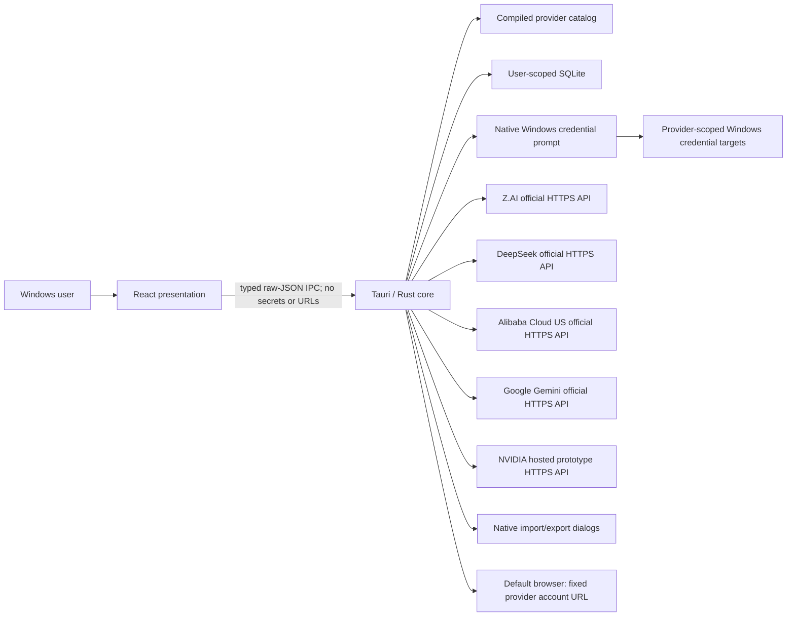
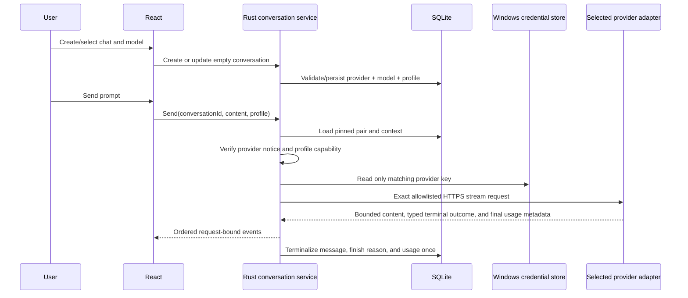
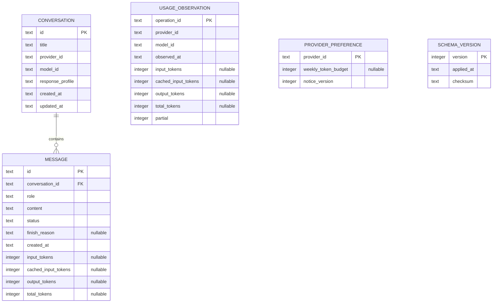

# Aster Desktop — MVP v2 Architecture

**Status:** Normative architecture baseline

**Last updated:** 2026-07-13

**Implementation status:** This document describes the required design. It does not assert that the implementation or any verification gate passes.

## 1. Architecture goals

- A Windows 11 desktop experience with local history and streamed direct-provider chat.
- A closed, auditable provider/model catalog with no arbitrary endpoint or model path.
- Secrets and privileged operations outside the React webview.
- Provider/model identity fixed for the life of a non-empty conversation.
- Honest response profiles and token observations without invented cross-provider semantics.
- Provider-scoped native credentials and explicit provider-specific disclosure.
- Transaction-safe SQLite migration, persistence, import, export, and usage accounting.
- Narrow default-browser account navigation without in-app billing mutations.
- Deterministic browser-demo presentation with no desktop capability, key, persistence, or network.

## 2. System context and trust boundaries



| Boundary | From → to                                    | Data                                                              | Primary protections                                                                                        |
| -------- | -------------------------------------------- | ----------------------------------------------------------------- | ---------------------------------------------------------------------------------------------------------- |
| `TB-01`  | User/provider/import → React                 | Untrusted Markdown, links, labels, status                         | React element allowlist renderer, no raw HTML execution, accessible app-owned chrome                       |
| `TB-02`  | React → Rust                                 | Raw UTF-8 JSON commands with IDs/text/enums                       | Main-window restriction, byte-before-parse bound, exact schema and state validation                        |
| `TB-03`  | Native prompt → Rust → credential store      | One provider API key                                              | Fixed prompt copy, provider allowlist, separate targets, zeroization, no secret IPC                        |
| `TB-04`  | Rust repository → SQLite                     | Conversations, messages, usage, preferences, migrations           | Parameterized SQL, foreign keys, transactions, bounds, corruption-safe failure                             |
| `TB-05`  | Rust adapters ↔ official provider APIs       | Sensitive context, authorization, untrusted streams/usage/balance | Compiled exact origins/paths, TLS, per-provider credentials, request fixtures, bounded parsing             |
| `TB-06`  | Native file dialog ↔ import/export           | Untrusted JSON / plaintext export                                 | Rust-owned dialog, exact versioned schema, bounded read/write, atomic import                               |
| `TB-07`  | Source/dependencies → build → package        | Code, lockfiles, binaries, signatures                             | Locked dependencies, clean-revision build identity, artifact/SBOM/dist hashes, inventory, signing evidence |
| `TB-08`  | Rust typed action → operating-system browser | Fixed official provider account URL                               | No renderer URL, fixed provider/action map, external browser only                                          |

### 2.1 Data classification

| Asset                                   | Classification               | Allowed locations                                                           | Prohibited behavior                                              |
| --------------------------------------- | ---------------------------- | --------------------------------------------------------------------------- | ---------------------------------------------------------------- |
| Provider API key                        | Secret                       | Native prompt, minimum-lived Rust value, matching Windows credential target | React, IPC, SQLite, logs, exports, another provider              |
| Prompts/responses/history               | Sensitive user content       | React for display, Rust, SQLite, selected provider request, explicit export | Unrelated provider/conversation, telemetry, diagnostics          |
| DeepSeek balance                        | Sensitive financial metadata | Minimum-lived Rust response and bounded status DTO for current session      | SQLite, export, logs, background polling, other provider         |
| Token usage observation                 | Internal usage metadata      | Rust and SQLite; bounded normalized counts and UTC time only                | Prompt/response/title/raw payload, billing or price claim        |
| Weekly provider budget                  | Internal configuration       | Rust and SQLite; provider ID plus bounded token integer                     | Credential storage, provider transmission, request authorization |
| Provider catalog/action map             | Public application policy    | Rust source/package and safe catalog DTO                                    | Runtime modification by renderer/import/remote model list        |
| Provider/model output and imported data | Untrusted                    | Validated storage and safe presentation                                     | Command, filesystem, URL, model-selection, or billing authority  |

Sensitive content crosses `TB-05` only after the UI identifies the selected provider and any fixed regional boundary. Alibaba Cloud is always identified as `Alibaba Cloud (US)` before transmission. Token usage is product state, not a diagnostic log. DeepSeek balance is not local token usage and the UI keeps those concepts separate.

## 3. Component responsibilities

| Component             | Owns                                                                                                   | Must not own                                                                    |
| --------------------- | ------------------------------------------------------------------------------------------------------ | ------------------------------------------------------------------------------- |
| React application     | Layout, accessible interaction, view state, safe Markdown, typed IPC client                            | Keys, SQL, provider HTTP, endpoint/model policy, filesystem paths, account URLs |
| Rust command boundary | Main-window authorization, raw body bounds, exact DTO validation, safe errors                          | Pre-deserialized unbounded input or UI-only authorization                       |
| Catalog service       | Provider/model IDs, default pair, display/capability metadata, adapter selection                       | Remote/user model discovery, unavailable entries, secrets                       |
| Conversation service  | Lifecycle, pinned provider/model, request/event identity, edit/regenerate, cancellation                | Provider-specific wire fields or UI rendering                                   |
| Provider adapters     | Exact URL/auth/request mapping, TLS, timeouts, one-attempt policy, stream parsing, usage normalization | Arbitrary origins, persistence, UI copy, cross-provider fallback                |
| Credential service    | Native prompt, provider-specific target, read/write/delete, minimum secret lifetime                    | Secret-bearing IPC or generic credential target                                 |
| Usage service         | Idempotent normalized observations, seven-day aggregates, per-provider budgets, partial coverage       | Prices, invoices, request blocking, raw provider payloads                       |
| Balance service       | Explicit DeepSeek read-only refresh, response validation, session-memory result                        | Background polling, mutation endpoint, persistence, non-DeepSeek balance calls  |
| Repository            | Migrations, parameterized SQLite transactions, import/export persistence                               | Credentials, raw provider traces, balance                                       |
| Native integration    | Credential/file dialogs and fixed provider account opener                                              | Renderer-supplied path/account URL or shell/process capability                  |

All security-sensitive services require deterministic seams. Tests use temporary SQLite, fake credential targets, fixed clocks, fake streams, and controlled HTTPS endpoints; they do not touch the user's database, credential store, or a billable endpoint by default.

## 4. Runtime profiles

### 4.1 Desktop

Desktop uses SQLite, native Windows dialogs, provider-scoped credential-store entries, exact HTTPS provider adapters, and the system browser. Production configuration contains no development URL, fake endpoint, key, or remote active UI asset.

### 4.2 Browser demo

Browser demo uses a deterministic in-memory adapter with a synthetic copy of the public catalog, synthetic response streams, synthetic usage coverage, and synthetic balance/account states. It has no credential command/control, desktop IPC, provider HTTP, SQLite, privileged filesystem, system opener, or persistence. It displays `Demo mode`, resets on reload, and cannot prove desktop or security acceptance.

## 5. Typed IPC boundary

Every application-defined call uses a raw UTF-8 JSON byte body and is available only to the main window. Rust enforces the 320-KiB ceiling before JSON parsing, then exact keys/types/enums/lengths/state. Stable safe errors contain only code, bounded message, and retryability.

| Operation                 | Renderer input                                                                                      | Safe result                                                            | Rust authority                                                                |
| ------------------------- | --------------------------------------------------------------------------------------------------- | ---------------------------------------------------------------------- | ----------------------------------------------------------------------------- |
| Get catalog/status        | None                                                                                                | Catalog v2, default pair, safe provider credential/reachability states | Catalog is compiled; no endpoint/key returned                                 |
| Create conversation       | Optional inherited catalog pair                                                                     | Conversation                                                           | Rust uses current pair or default `zai`/`glm-5.1`; pair validated             |
| Change empty selection    | Conversation ID, provider ID, model ID                                                              | Updated conversation or locked error                                   | Rust checks catalog and zero-message invariant transactionally                |
| Conversation CRUD         | Validated IDs/title/confirmation                                                                    | Conversation/selection result                                          | Parameterized SQL; delete atomic                                              |
| Prompt/store credential   | Provider ID only                                                                                    | Configured/cancelled status                                            | Fixed native prompt/target selected from provider registry                    |
| Remove/check credential   | Provider ID only                                                                                    | Configured status                                                      | No value crosses IPC; provider-scoped target                                  |
| Send/edit/regenerate/stop | Conversation/message IDs, visible content, profile                                                  | Request ID/status/events                                               | Rust loads pinned pair, validates profile/state, owns networking/cancellation |
| Get Usage                 | Provider ID and optional catalog model filter                                                       | Normalized seven-day counts, coverage, budget                          | Local SQLite only; no provider call                                           |
| Set/clear budget          | Provider ID and bounded integer or explicit clear                                                   | Updated advisory budget                                                | Provider allowlist, checked integer, transaction                              |
| Read/refresh balance      | None                                                                                                | DeepSeek bounded balance DTO/status                                    | DeepSeek-only commands; status is memory-only and refresh is explicit         |
| Open provider account     | Provider ID and exact action enum value: `usage`, `billing`, `addCredits`, `spend`, or `deployment` | Success/safe error                                                     | Rust chooses fixed URL; caller supplies neither model ID nor URL              |
| Import/export             | No path or serialized desktop file                                                                  | Count/cancel/status                                                    | Rust owns native file dialog and complete validation                          |
| Open content link         | Bounded HTTPS URL from an explicit rendered-link click                                              | Success/safe error                                                     | Separate `ADR-0006` validation; never used for account actions                |

Provider ID, model ID, and action are untrusted enums at the IPC boundary even though React obtained them from the catalog. A compromised renderer cannot use them to select an unregistered combination.

## 6. Conversation and provider flow



New chat inherits the pair only from a fully loaded conversation whose ID equals the current selection. If there is no selected conversation, Rust applies the catalog default `zai`/`glm-5.1`; New chat and Ctrl+N are disabled while a selected conversation is loading or its empty pair mutation is pending. React clears the prior loaded object when navigation begins, disables conversation-bound actions while loading or changing an empty conversation's pair, and applies asynchronous load/create/mutation results only when their operation authority and selected conversation ID still match. Navigation invalidates earlier authorities; a stale create may merge its backend-created summary but cannot change selection, conversation, or draft. Model selection from the no-conversation composer preserves that draft. Visible-load and background-reconciliation authorities are independent so a terminal event for one conversation cannot invalidate or wedge another conversation's load. An empty conversation may change pair. Once the first message is persisted, both columns are immutable. A backend update attempt returns `CONVERSATION_MODEL_LOCKED`; the UI may then request creation of a distinct empty conversation after explicit confirmation. There is no context migration or silent provider fallback. Before networking, Rust compares the stored per-provider notice version with the catalog disclosure version; a mismatch returns `PROVIDER_NOTICE_REQUIRED`, and only explicit acknowledgement of that exact provider/version enables the send.

### 6.1 Cancellation and explicit retry

Stop resolves the request ID to a Rust-owned cancellation token, aborts the HTTP operation/body read, terminalizes once, and rejects stale/duplicate events. Hiding UI output is not cancellation.

MVP v2 performs exactly one provider attempt per validated send. Authentication, rate-limit, transient connection, timeout, and provider failures terminalize with an actionable state and are never retried automatically, even before visible content, because an unseen request may already have consumed tokens. A later retry is a new explicit user action with a new operation identity and coverage observation.

## 7. Provider and usage boundary

The catalog selects one of five concrete adapter families. Each applies the exact endpoint, authentication, request fields, response profiles, usage mapping, and finish semantics in [provider-contract.md](provider-contract.md). No general-purpose base URL exists in settings, IPC, import, or SQLite.

Stream parsers are bounded, pure where practical, and fuzzable. They tolerate legal split UTF-8/line boundaries, reject the first malformed or unsupported event, reject early/duplicate/out-of-order terminal or usage claims and unknown capability-bearing fields, discard hidden reasoning, and never execute tools. Raw provider errors do not cross IPC. A successful terminal maps to typed `stop` or `outputLimit`; the latter preserves validated partial visible content and usage and is never silently converted to a normal completion. Completed legacy/imported assistant messages without authoritative terminal evidence use `unknown`.

Usage normalization has four disjoint optional non-negative integer fields:

- `input_tokens`: non-cached input;
- `cached_input_tokens`: cached input;
- `output_tokens`: visible output plus provider-documented thought/reasoning tokens where applicable; and
- `total_tokens`: the checked sum of the other three when the observation is complete.

When a provider prompt count includes cached input, the adapter subtracts the validated cached count. Missing data remains null and makes coverage partial. Negative, fractional, inconsistent, or overflowing values are ignored as usage metadata without changing a completed answer. Immediately before the first network attempt for a validated send, Rust creates exactly one partial coverage observation bound to the operation. Authoritative final usage fills that row once. Cancellation, provider/connection failure, timeout, malformed/missing usage, or legal terminal without usage leaves it partial with nullable fields. Pre-network notice, profile, credential, input, state, or persistence failure creates no observation. Duplicate terminal frames cannot add or replace an observation, and MVP v2 has no automatic retry.

The Usage query aggregates observations whose UTC completion timestamp is in the trailing `now - 7 days` through `now` interval. It scopes the result to one provider and optionally one model. The budget is per provider and uses known `total_tokens` only. Rust classifies low state with the exact safe-integer comparison `remaining <= floor(budget / 10)`; the percentage is display-only. If the provider-wide known-total aggregate exceeds the JavaScript-safe range, the budget remains present with `knownUsedTokens = null`, zero remaining, exhausted state, and partial coverage. React explains that the exact total exceeds the supported display range rather than displaying a fabricated number. Partial coverage remains visible because the budget may undercount. No budget blocks or modifies a provider request.

DeepSeek balance refresh is a separate explicit network action. It is not included in local aggregates and is held only in Rust memory for the session. Rust binds each refresh to a credential generation and monotonically latest operation. Under one balance-authority synchronization, a current completion commits its memory result and reachability; credential replace/delete instead invalidates every earlier operation, clears memory, and resets reachability. A stale completion can update neither field. Other providers expose no balance command path.

## 8. Resource and timing baseline

These fixed bounds apply independently at their stated layers:

| Boundary                                  |                                                                                                       MVP v2 limit |
| ----------------------------------------- | -----------------------------------------------------------------------------------------------------------------: |
| API-key input                             | 8–255 printable ASCII bytes without whitespace; full 256-character native result rejected as potentially truncated |
| Provider/model/action ID                  |                                                                       Exact registered enum; no free-form fallback |
| Token field or weekly budget crossing IPC |             Integer 0 through 9,007,199,254,740,991 (`Number.MAX_SAFE_INTEGER`); a configured budget is at least 1 |
| Conversation title                        |                                                       1–80 Unicode scalar values after trim; no control characters |
| Composer usability                        |                                                                                           32,000 UTF-16 code units |
| Raw IPC command body                      |                                                                        320 KiB before JSON parsing/tree allocation |
| Backend user message                      |                                                                                                      256 KiB UTF-8 |
| Stored user/assistant message             |                                                                                                        2 MiB UTF-8 |
| Provider history                          |                                                                             200 messages and 512 KiB visible UTF-8 |
| Serialized provider request               |                                                                                                              1 MiB |
| Provider response headers                 |                                                                                         64 fields and 32 KiB total |
| SSE transport                             |                                                                                                              8 MiB |
| Buffered SSE line                         |                                                                                                             64 KiB |
| SSE event                                 |                                                                                                            128 KiB |
| Visible delta                             |                                                                                                             64 KiB |
| Ordered renderer events per response      |                                                                                                             65,536 |
| Accumulated visible response              |                                                                                                              2 MiB |
| Invalid/unsupported stream event          |                                                                                         Fail closed on first event |
| Balance response body                     |                                                                             64 KiB and at most 16 currency entries |
| Connect timeout                           |                                                                                                         10 seconds |
| Idle/read timeout                         |                                                                                                         45 seconds |
| Overall chat operation                    |                                                                                                         10 minutes |
| Balance operation                         |                                                                             30 seconds overall; no automatic retry |
| Automatic chat attempts                   |                                                                           Exactly one; automatic retry is disabled |
| Retry/backoff                             |                                                                None; a retry is a distinct explicit user operation |
| Native import                             |                                                                              32 MiB before and during bounded read |
| Native export                             |                                                                                    32 MiB before save dialog/write |
| Imported collection                       |                                                                    1–100 conversations and at most 10,000 messages |
| Imported JSON nesting                     |                                                    At most 8 open object/array levels before typed deserialization |

Provider-token budgets do not replace byte/character bounds. Rust may use a wider checked accumulator internally, but every individual field and aggregate crossing JSON IPC must fit `Number.MAX_SAFE_INTEGER`; otherwise the safe result is an overflow/partial state, not a rounded JavaScript number. All token addition/subtraction uses checked integer arithmetic.

## 9. Persistence and migration



The v2 migration is transactional and idempotent. Before a table rebuild or destructive step, Rust uses SQLite's backup API to create a WAL-consistent snapshot at a deterministic sibling filename under the same current-user ACL; `fs::copy` or a live database-file copy is prohibited. Rust verifies the snapshot's SQLite integrity, exact v1 schema/version, and expected source identity before changing the original. After interruption it may reuse only that same verified v1 backup; an unverified or conflicting sibling blocks migration. It rebuilds the v1 conversation constraint, assigns `provider_id = "zai"` and `model_id = "glm-5.1"`, preserves the profile, maps legacy `token_usage` only to nullable message `total_tokens`, leaves the unavailable breakdown null, and assigns `finish_reason = "unknown"` only to completed legacy assistant messages because v1 contains no authoritative terminal evidence. It creates no usage observation from a v1 total because that value may have come from an import and is not proven locally incurred; rolling tracking begins only with authoritative v2 operations. After commit, Rust verifies v2 integrity/schema before deleting the verified backup. On failure the backup remains for recovery. A later successful startup may remove only a verified orphan matching the completed migration identity and never deletes an unknown sibling. Any corruption or verification failure is reported rather than replaced.

Implementation rules remain: backend-generated opaque IDs, foreign keys enabled, parameterized SQL only, bounded fields, terminal stored statuses, constrained typed finish reasons, transaction-safe edits/deletes/finalization, current-user application-data permissions, no application diagnostics, and no credential/header/raw provider trace/hidden reasoning/balance in SQLite.

Conversation message usage is valid only on a complete assistant row; schema
constraints and Rust row mapping reject usage attached to a user, cancelled, or
error row. Usage-observation operation IDs and timestamps use canonical UUID and
UTC representations. Before lexical time filtering or aggregation, Rust
validates every ledger row's identity, catalog pair, UTC time, token arithmetic,
and partial-state invariant because SQLite content is untrusted.

Conversation deletion removes messages but does not retroactively erase a recent usage observation because provider consumption already occurred. Usage observations older than the product's trailing seven-day needs may be pruned transactionally. Clearing a provider budget does not clear observations or credentials.

## 10. Versioned import and export

Rust-owned native dialogs select files. React supplies neither a path nor serialized desktop payload. Export writes version 2 only; import accepts exact version 1 and version 2 schemas.

The v2 conversation shape is:

```json
{
  "format": "aster-conversation",
  "version": 2,
  "exportedAt": "2026-07-13T12:00:00Z",
  "conversations": [
    {
      "title": "Example",
      "provider": "zai",
      "model": "glm-5.1",
      "responseProfile": "standard",
      "createdAt": "2026-07-13T11:00:00Z",
      "updatedAt": "2026-07-13T12:00:00Z",
      "messages": [
        {
          "role": "user",
          "content": "Visible message text",
          "createdAt": "2026-07-13T11:01:00Z",
          "status": "complete"
        },
        {
          "role": "assistant",
          "content": "Visible response text",
          "createdAt": "2026-07-13T11:02:00Z",
          "status": "complete",
          "finishReason": "stop",
          "usage": {
            "inputTokens": 8,
            "cachedInputTokens": 2,
            "outputTokens": 32,
            "totalTokens": 42
          }
        }
      ]
    }
  ]
}
```

Each optional usage member is independently nullable/omittable, but a complete four-field object must satisfy the disjoint sum. Version 1 accepts only its historical `model: "glm-5.1"`, `reasoningMode`, and optional total `tokenUsage`, and maps it to `zai`, `glm-5.1`, the corresponding response profile, total-only usage, and `finishReason: "unknown"` for completed assistant messages. Version 2 requires a current catalog provider/model pair, a profile valid for that pair, and the exact finish-reason invariant: completed assistant messages carry `stop`, `outputLimit`, or `unknown`; user, cancelled, and error messages omit it. Import never changes an existing conversation's pinned pair or infers `stop` from absent evidence.

Both versions enforce the section 8 file/nesting/count/field bounds; exact keys and types; RFC 3339 timestamps normalized to UTC; `updatedAt >= createdAt`; allowed roles/statuses; complete non-whitespace content; control-character policy; checked usage integers and invariants; and full validation before one insert transaction. Unknown fields, unsupported versions/pairs/profiles, source/local IDs, `conversationId`, derived counts, credentials, budgets, aggregate usage, balance, configuration, paths, headers, raw requests, logs, and hidden reasoning are rejected. Rust generates all local IDs. A failure leaves the database unchanged.

Export contains one selected conversation, warns that it is sensitive plaintext, stops before the native save dialog if serialization exceeds 32 MiB, and excludes provider preferences, aggregate usage observations, balances, credentials, and internal identifiers.

## 11. Safe presentation, account navigation, and errors

Markdown is rendered as React elements with raw HTML disabled and a strict allowlist. Dangerous URL schemes, attributes, embedded content, and executable markup are rejected. Content links use the separate validated HTTPS navigation policy in `ADR-0006` and cannot navigate the webview or invoke provider-account actions.

Provider account navigation accepts only a provider and one exact JSON action value: `usage`, `billing`, `addCredits`, `spend`, or `deployment`. Rust maps the pair to the exact official URL in the provider contract and opens the operating-system default browser. The React call contains neither model ID nor URL; user-facing labels are catalog metadata. Unsupported pairs, wrong-window calls, and encoded injection fail safely. Aster never observes the browser session or claims a purchase/plan change succeeded.

A Usage result is `current` only when its latest local query or explicit balance refresh succeeded. If a later query fails, the UI may retain the previous timestamped result as `stale` while showing the new failure; it must not replace the error or imply a refresh succeeded. Provider network unreachability is `offline`, not stale by itself. A browser-demo stale state is explicitly synthetic.

User-visible errors identify the provider and one stable category: credential missing/rejected, profile incompatible, offline/TLS, rate limit, provider unavailable, timeout, content/context rejection, malformed response, database failure, balance unavailable/stale, or cancellation. They never interpolate raw provider bodies, SQL, paths, credentials, imported markup, balance payloads, or account URLs supplied by content.

## 12. Verification seams and governing decisions

Required seams include catalog snapshot/negative lookup tests; exact per-adapter request/stream/usage fixtures; fake credential targets and native-prompt classifiers; temporary SQLite migration/fault injection; fixed clocks for seven-day aggregation; fake DeepSeek balance server; account action-map tests; and browser-demo network/storage spies.

Governing decisions:

- [ADR-0001](decisions/0001-rust-trust-boundary.md): Rust trust boundary.
- [ADR-0002](decisions/0002-local-data-and-secrets.md): local conversations and separate secrets.
- [ADR-0004](decisions/0004-browser-demo-isolation.md): browser-demo isolation.
- [ADR-0006](decisions/0006-rust-scoped-external-links.md): untrusted content links.
- [ADR-0008](decisions/0008-native-credential-capture.md): native secret capture.
- [ADR-0009](decisions/0009-no-persistent-diagnostics.md): no persistent diagnostics.
- [ADR-0011](decisions/0011-curated-direct-provider-registry.md): curated direct multi-provider registry and profiles.
- [ADR-0012](decisions/0012-provider-scoped-native-credentials.md): provider-scoped credentials.
- [ADR-0013](decisions/0013-conversation-model-lock-and-usage-ledger.md): pinned conversations and local usage.
- [ADR-0014](decisions/0014-read-only-balance-and-account-navigation.md): read-only balance and typed account navigation.
