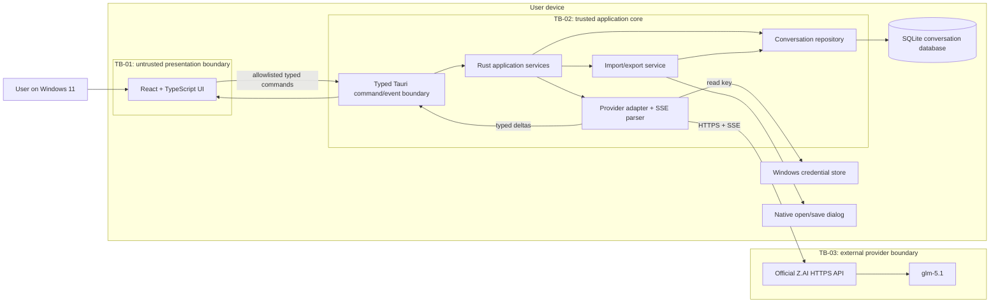
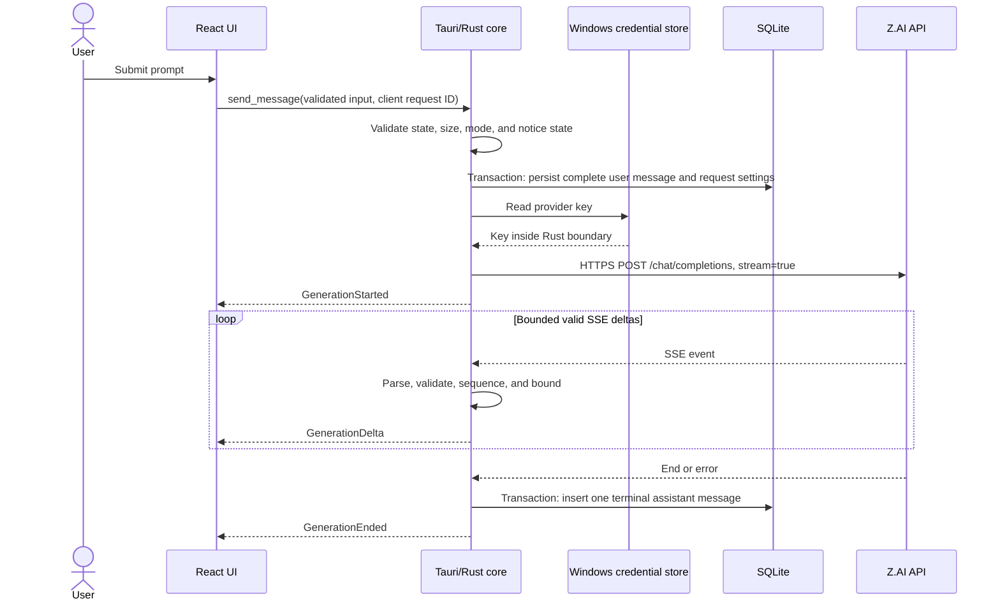
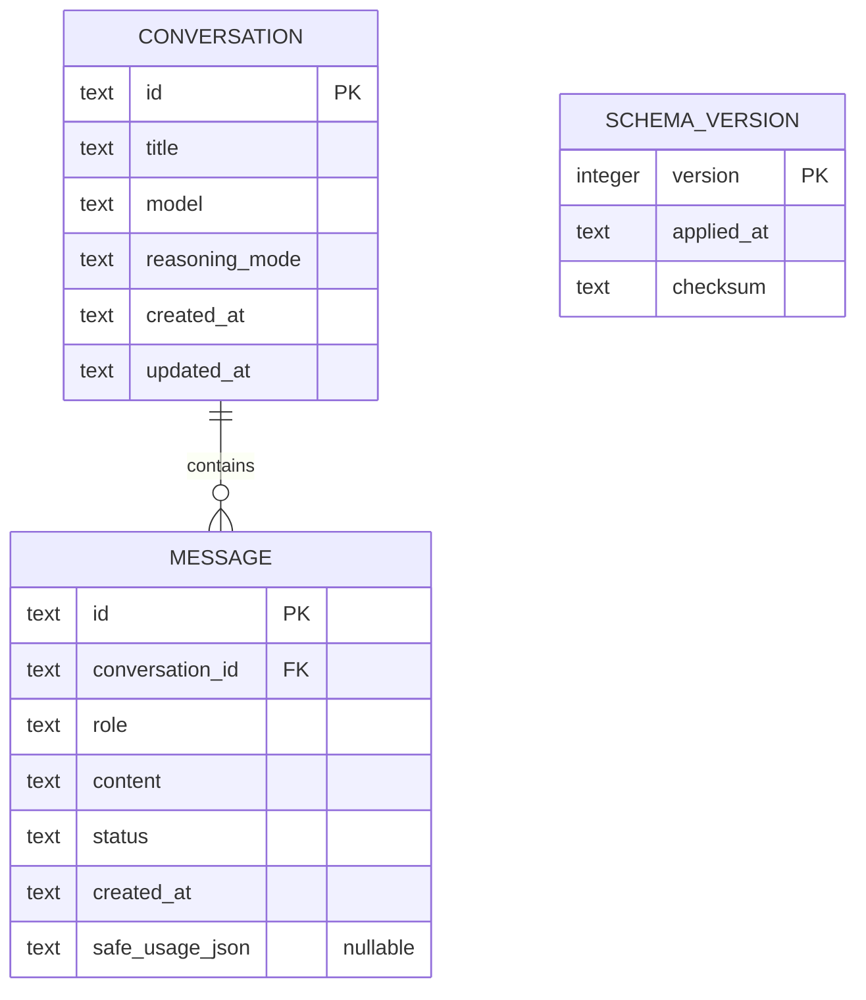

# Aster Desktop — MVP v1 Architecture

**Status:** Normative architecture baseline

**Target:** Windows 11 desktop

**Last updated:** 2026-07-12

**Implementation status:** This is the required target architecture. Present-tense diagrams name responsibilities and boundaries; they are not evidence that a revision or package implements them.

## 1. Architecture goals

This architecture supports the requirements in [product-spec.md](product-spec.md) while enforcing the controls in [security-requirements.md](security-requirements.md). Its central design rule is that the React webview is untrusted presentation code. All secret-bearing, persistent, networked, or policy-enforcing operations terminate in Rust.

The MVP optimizes for:

- a small and auditable privilege surface;
- responsive streamed chat with real cancellation;
- deterministic local persistence and recovery;
- Windows-native credential storage and file selection;
- safe treatment of model output and imported data;
- testable boundaries with replaceable adapters;
- no dormant permissions for deferred projects, attachments, or tools.

## 2. System context and trust boundaries



### 2.1 Assets

| Asset                       | Classification                      | Authoritative owner                                                  | Notes                                                 |
| --------------------------- | ----------------------------------- | -------------------------------------------------------------------- | ----------------------------------------------------- |
| Z.AI API key                | Secret                              | Native credential prompt, Rust process, and Windows credential store | Never enters the webview or crosses IPC               |
| Prompt and response content | Sensitive user content              | SQLite / Rust repository                                             | Sent externally only as required for a user request   |
| Conversation metadata       | Sensitive metadata                  | SQLite / Rust repository                                             | Includes timestamps and model settings                |
| Import/export content       | Untrusted and potentially sensitive | Rust import/export service                                           | Versioned, bounded, validated                         |
| Application configuration   | Internal                            | Rust configuration service                                           | Must not contain credentials                          |
| Safe application errors     | Internal                            | Ephemeral Rust/IPC values                                            | Stable code, bounded message, and retryable flag only |
| Packaged application        | Integrity-critical                  | Build/release pipeline                                               | Production artifacts require signature evidence       |

### 2.2 Data classification rules

`Secret` data may only cross the credential-store/provider boundary in Rust. `Sensitive user content` may cross to Z.AI only after the external-processing notice and explicit send action. It may cross to a user-selected export path only after an export action and warning. `Untrusted` is a validation property, not a confidentiality level: imported text and model output remain untrusted even when stored locally.

## 3. Component responsibilities

| Component               | Owns                                                                                            | Must not own                                                                          |
| ----------------------- | ----------------------------------------------------------------------------------------------- | ------------------------------------------------------------------------------------- |
| React application       | Layout, accessible interaction, local view state, safe Markdown presentation, typed IPC client  | Provider credentials, SQL, direct external HTTP, filesystem paths, security decisions |
| Tauri command layer     | Window allowlist, request deserialization, semantic validation, stable result/error envelope    | Business logic duplication, raw database handles in responses                         |
| Conversation service    | Chat lifecycle, one-active-request rule, edit/regenerate semantics, transactional state changes | UI rendering or OS credential implementation                                          |
| Provider adapter        | Request mapping, authorization injection, timeouts, bounded retry, SSE parsing, cancellation    | Persisting credentials, arbitrary origins, UI event decisions                         |
| Credential adapter      | Store/replace/delete/check existence of key                                                     | Returning the key to the UI, logging key material                                     |
| Conversation repository | Migrations, parameterized CRUD, transactions, ordering                                          | Network calls, rendering Markdown                                                     |
| Import/export service   | Versioned schema, size/shape validation, atomic import, safe serialization                      | Interpreting imported markup, arbitrary path construction                             |

Security-sensitive logic **MUST** expose deterministic test seams. An interface **MAY** be a Rust trait where runtime substitution is needed; the MVP may use concrete database, credential-store, provider, and native-dialog adapters when pure validators, temporary SQLite databases, controlled inputs, and parser fixtures provide equivalent isolation. Tests **MUST NOT** touch a real credential store, user database, arbitrary filesystem location, or paid endpoint.

## 4. Runtime profiles

### 4.1 Desktop profile

The desktop profile **MUST** register only the production command handlers and concrete adapters required by the MVP:

- SQLite database in the application data directory with user-scoped permissions;
- Rust-owned native Windows credential prompt and credential-store entry scoped to this application and provider;
- HTTPS provider client with platform certificate validation and exact-origin policy;
- native open/save dialogs for import and export;
- restrictive Tauri capability and Content Security Policy configuration.

### 4.2 Browser demo profile

The browser profile exists only to inspect UI behavior when Tauri is unavailable. It **MUST** use a deterministic, in-memory chat adapter and non-sensitive sample data. It has no credential method, external networking, SQLite, privileged filesystem, or persistence capability. A user-initiated browser file picker and download may exercise demo import/export presentation, but do not prove the desktop native-dialog or Rust validation path. The UI **MUST** display `Demo mode`; security and desktop acceptance tests cannot use this profile as evidence.

Production builds must not include hidden development endpoints, provider proxies, seeded private conversation data, or a default API key. The loopback Vite URL exists only in `tauri.dev.conf.json`, which the explicit desktop-development script overlays; it is absent from the production Tauri configuration and release context.

## 5. Typed IPC boundary

The exact names may follow the implementation's naming convention, but the v1 command surface is limited to these capabilities:

| Capability                        | Input                                                            | Output                             | Security invariant                                                                                 |
| --------------------------------- | ---------------------------------------------------------------- | ---------------------------------- | -------------------------------------------------------------------------------------------------- |
| List/get conversations            | Pagination/ID                                                    | Sanitized records                  | Bounded page size; opaque valid ID                                                                 |
| Create/rename/delete conversation | Validated title/ID/confirmation token if used                    | Updated selection/result           | Parameterized SQL; delete atomic                                                                   |
| Send/regenerate/edit-and-send     | Conversation/message ID, text, reasoning mode, client request ID | Accepted request envelope          | Length limits; no caller-supplied URL/model/header                                                 |
| Cancel generation                 | Request ID                                                       | Cancellation state                 | Request belongs to current app session                                                             |
| Credential prompt/delete/status   | No secret-bearing renderer input                                 | Success or boolean status          | Native prompt and Rust own capture; secret never enters webview/IPC/result/error                   |
| Import/export                     | Export conversation ID, or no renderer input for import          | Cancellation-safe summary/result   | Rust opens the native dialog; no renderer-supplied path or serialized file payload; bounded schema |
| Open external HTTPS link          | Bounded absolute URL                                             | Success or safe error              | Rust revalidates scheme/host/credentials/locality; OS browser only; no raw opener permission       |
| Application status                | None                                                             | Safe version/provider/config state | No secret or sensitive path disclosure                                                             |

The borderless Windows shell additionally grants only `core:window:allow-minimize`, `core:window:allow-toggle-maximize`, `core:window:allow-close`, and `core:window:allow-start-dragging` to the main window. These support the visible custom title bar and do not permit window creation or arbitrary window mutation.

The webview adapter serializes every application-defined command argument object to UTF-8 JSON bytes and invokes Tauri with a `Uint8Array`; an argument-free application command sends raw `{}`. Rust rejects Tauri's pre-deserialized `InvokeBody::Json` form for these commands, checks the raw body against the 320-KiB ceiling before JSON parsing, validates nesting and the per-command key allowlist, deserializes into deny-unknown-field structures, and then performs semantic validation. This prevents typed application-command extraction or JSON-tree expansion from preceding the application boundary check. Tauri's four exact window actions and event listen/unlisten APIs remain framework-owned capabilities with no application data structure. Errors cross IPC only as a stable code, bounded safe user message, and retryable flag. Aster v1 does not create an application diagnostic log.

The event surface is similarly narrow:

```text
GenerationStarted { requestId, conversationId, sequence: 0 }
GenerationDelta   { requestId, conversationId, sequence, text }
GenerationEnded   { requestId, conversationId, sequence, message?, status, safeUsage? }
```

The frontend accepts an event only when the request and conversation IDs match its active request and the sequence is the exact next value. The persisted assistant message identifier is returned only in the terminal `message` record. Duplicate, stale, cross-conversation, oversized, or out-of-order events are rejected or terminate the request safely according to the stream state machine.

## 6. Conversation flow



The provider request selects the application-owned endpoint and `glm-5.1`; callers cannot override an origin, authorization header, or arbitrary model. Relevant prior user/assistant messages are read in deterministic order. The API key is inserted only immediately before the HTTPS request.

### 6.1 Cancellation

Cancellation is a backend state transition, not a cosmetic UI action:

1. UI sends the active request ID once and immediately renders `Stopping…`.
2. Rust resolves the request ID to an owned cancellation token.
3. The token aborts the HTTP body read/request future.
4. Rust commits accumulated partial content as `cancelled`, or an empty cancelled placeholder according to repository rules.
5. Rust emits exactly one terminal event and removes the active request entry.
6. Any late transport event is dropped and cannot change a terminal message.

Closing a window or the application cancels in-flight work before shutdown. `streaming` and `stopping` exist only in runtime/UI state and are not persisted or importable. After an ungraceful exit, the already-committed user message remains and no complete assistant message is fabricated. A validated partial response may be persisted as `cancelled` or `error` only through the normal terminalization path.

### 6.2 Retry policy

The application never retries authentication or invalid-request errors. A transient connection failure or selected provider error may be retried only before response content has been surfaced, with a low fixed attempt limit, jittered exponential backoff, and provider `Retry-After` handling. Once content is visible, automatic replay is prohibited because it can duplicate cost or content; the user receives a retry/regenerate action.

## 7. Provider and stream boundary

The provider adapter **MUST** target the official Z.AI chat completions service over HTTPS. It applies:

- exact HTTPS origin and documented path allowlisting;
- normal hostname and certificate-chain validation;
- connect, headers, idle/read, and overall request limits;
- bounded request body, response headers, SSE line/event, delta, and total response sizes;
- strict UTF-8/event parsing with graceful failure of malformed or incomplete streams;
- authorization and error redaction before any diagnostic formatting;
- support only for the verified `thinking.type` values `enabled` and `disabled`, with application-owned output caps of 4,096, 8,192, and 16,384 tokens for Fast, Standard, and Deep respectively;
- no proxy controlled by IPC or model content.

The exact request/response fields verified for this MVP, the official-source links, and the boundary between provider facts and application policy are recorded in [provider-contract.md](provider-contract.md). Re-verifying documentation does not replace request snapshot, fake-server, or packaged network-policy tests.

An SSE parser is a pure, fuzzable state machine. It must tolerate legal chunk boundaries, including split UTF-8 and split lines, without accepting unlimited buffering. Provider error bodies are untrusted and do not become raw HTML or an unbounded UI message.

### 7.1 Resource and timing baseline

These fixed MVP bounds implement `FR-005`, `FR-014`, `SEC-008`, `SEC-010`, `SEC-018`, and `SEC-024`. A limit change is a behavior and abuse-resistance change: update the owning requirement, threat review, acceptance fixture, and implementation together.

| Boundary                      |                                                                                                                                                    MVP v1 limit |
| ----------------------------- | --------------------------------------------------------------------------------------------------------------------------------------------------------------: |
| API-key input                 | 8 through 255 printable ASCII bytes, with no whitespace; the 257-unit native buffer includes a reserved full-length/truncation sentinel and the terminating NUL |
| Conversation title            |                                                                     1 through 80 Unicode scalar values after surrounding-whitespace trim; no control characters |
| Composer usability limit      |                                                                                                                                        32,000 UTF-16 code units |
| Raw IPC command body          |                                                                                                             320 KiB before JSON parsing or JSON-tree allocation |
| Backend user-message input    |                                                                                                                                          256 KiB of UTF-8 bytes |
| Stored assistant/user message |                                                                                                                                            2 MiB of UTF-8 bytes |
| Provider history              |                                                                                                               200 messages and 512 KiB of visible UTF-8 content |
| Serialized provider request   |                                                                                                                                                           1 MiB |
| Provider response headers     |                                                                                                                                      64 fields and 32 KiB total |
| SSE transport                 |                                                                                                                                                           8 MiB |
| Buffered SSE line             |                                                                                                                                                          64 KiB |
| SSE event                     |                                                                                                                                                         128 KiB |
| Visible delta                 |                                                                                                                                                          64 KiB |
| Accumulated visible response  |                                                                                                                                                           2 MiB |
| Invalid/unsupported SSE event |                                                                                                                                  Fail closed on the first event |
| Connect timeout               |                                                                                                                                                      10 seconds |
| Idle/read timeout             |                                                                                                                                                      45 seconds |
| Overall provider operation    |                                                                                                                                                      10 minutes |
| Automatic attempts            |                                                                        At most two total, only before visible content and only for permitted transient outcomes |
| Backoff delay                 |                                                                                   At most 5 seconds per retry, including validated provider guidance and jitter |
| Provider context selection    |                                                                                   Most recent supported messages within both the 200-message and 512-KiB limits |
| Native import file            |                                                                                                                  32 MiB, checked before and during bounded read |
| Native export serialization   |                                                                                                                         32 MiB before the save dialog and write |
| Imported collection           |                                                                                                   1 through 100 conversations and at most 10,000 messages total |
| Imported JSON nesting         |                                                                              At most 8 open object/array container levels, checked before typed deserialization |

The UI's 32,000-unit composer limit is an early usability check. Rust independently enforces the larger 256-KiB trust-boundary ceiling so a compromised renderer cannot submit an unbounded message. Limits are measured at the layer stated and are not interchangeable with provider tokens.

## 8. Persistence model

SQLite is the source of truth for local conversation history. The minimum logical schema is:



Implementation rules:

- IDs are generated by the backend and treated as opaque.
- Foreign keys are enabled; conversations delete messages atomically.
- Content and title lengths are bounded before persistence.
- Persisted user messages are `complete`; persisted assistant messages are terminal `complete`, `cancelled`, or `error`. Runtime `streaming` and `stopping` states are never database, import, or export enum values.
- SQL is parameterized, including search-like operations if later introduced.
- Schema migrations are ordered, checksummed when supported, transaction-safe, and tested both forward and from the prior supported schema.
- The database never stores API credentials, authorization headers, provider raw traces, or hidden reasoning.
- Database corruption produces a recoverable error path; the application does not silently replace or destroy a user's database.
- File permissions are scoped to the current Windows user. This MVP does not claim application-level database encryption.

## 9. Import and export

Export is a serialization of one selected conversation into a versioned application schema. Rust opens a native save dialog, writes only to the user-selected result, and returns cancellation-safe metadata rather than a filesystem path. The export contains only the fields needed to recreate the conversation and excludes secrets and internal identifiers. React never receives the serialized export merely to perform privileged filesystem I/O.

The exact v1 JSON shape is:

```json
{
  "format": "aster-conversation",
  "version": 1,
  "exportedAt": "2026-07-12T12:00:00Z",
  "conversations": [
    {
      "title": "Example",
      "model": "glm-5.1",
      "reasoningMode": "standard",
      "createdAt": "2026-07-12T11:00:00Z",
      "updatedAt": "2026-07-12T12:00:00Z",
      "messages": [
        {
          "role": "user",
          "content": "Visible message text",
          "createdAt": "2026-07-12T11:01:00Z",
          "status": "complete"
        },
        {
          "role": "assistant",
          "content": "Visible response text",
          "createdAt": "2026-07-12T11:02:00Z",
          "status": "complete",
          "tokenUsage": 42
        }
      ]
    }
  ]
}
```

`tokenUsage` is omitted when unavailable. No other field is valid. In particular, source conversation/message IDs, `conversationId`, derived `messageCount`, credentials, configuration, paths, headers, requests, logs, and `reasoning_content` are prohibited. The desktop export command produces exactly one conversation; the importer accepts 1 through 100 for forward-compatible bundle handling.

Before a transaction, import enforces the section 7.1 file, nesting, count, title, and content limits; exact format/version; `model: "glm-5.1"`; the three reasoning modes; RFC 3339 timestamps with conversation `updatedAt >= createdAt`; and optional `tokenUsage` no greater than signed 64-bit SQLite range. Only `user` and `assistant` roles are accepted. User status is always `complete`; assistant status is `complete`, `cancelled`, or `error`. Complete content is non-whitespace. Cancelled/error assistant content may be empty. Content rejects NUL and every control character except CR, LF, and tab. Accepted timestamps are normalized to UTC for storage, and Rust generates every local ID.

Import follows an explicit, atomic design:

1. Rust opens a native dialog that yields a user-selected file/handle; React supplies neither a path nor file content.
2. Rust checks file size before full allocation.
3. A strict versioned parser rejects unknown incompatible versions and invalid types, enums, counts, lengths, and timestamps.
4. The entire logical document is validated without rendering or executing its content.
5. Backend-generated IDs are assigned and one transaction inserts all data.
6. Any error rolls back the transaction completely.

The native file selection is the explicit import action. MVP v1 does not add a second preview/confirmation step because import is additive, does not overwrite existing conversations, and remains reversible through the separately confirmed conversation-delete flow. After success, the UI reports the number imported. A future merge/overwrite import mode would require a new requirement, threat review, preview, and deliberate confirmation before implementation.

Imports never restore API keys, configuration, filesystem paths, request IDs, tool messages, HTML execution state, or provider headers. Exports warn that the JSON file contains plaintext conversation content.

## 10. Safe presentation

The frontend renders Markdown using a pinned allowlist parser/renderer that constructs React elements and never interprets model text as HTML. If an HTML sink is ever introduced, the approved allowlist sanitizer must run immediately before that sink. The renderer is configured to:

- disable or remove raw HTML;
- allow only the elements and attributes required by `FR-009`;
- remove event handlers, embedded content, forms, SVG/MathML unless explicitly and safely supported, inline style, and scriptable attributes;
- allow only approved link protocols and open external links outside the webview with safe opener isolation;
- render code as text even when a language name is hostile or unsupported;
- avoid network-fetched syntax themes, scripts, images, or fonts.

Copy actions copy the underlying text, not executable HTML. Mermaid rendering is not an MVP requirement; if added later, it requires a separate threat-model update because diagram syntax and rendering expand the parser/rendering surface.

## 11. Error and recovery model

Stable backend error families include:

| Family                      | UI outcome                               | Retry behavior                |
| --------------------------- | ---------------------------------------- | ----------------------------- |
| Credential missing/rejected | Open settings or replace credential      | Never automatic               |
| Rate limited                | Show wait guidance and safe retry time   | User action after limit       |
| Provider unavailable        | Preserve prompt and partial state        | Bounded policy or user action |
| Provider content rejected   | Explain the safe content-policy category | Never automatic               |
| Provider context limit      | Advise starting a new conversation       | Never automatic               |
| Offline/TLS/network         | Show connectivity guidance               | Bounded before first delta    |
| Timeout                     | Mark response failed/interrupted         | User action                   |
| Malformed/oversized stream  | Stop and show provider-response error    | Never automatic               |
| Validation/import           | Explain rejected field/category safely   | After user correction         |
| Storage                     | Preserve UI input; offer retry/recovery  | No destructive auto-reset     |
| Cancelled                   | Keep clear cancelled state               | User may regenerate           |

Error messages never interpolate raw provider bodies, SQL text, filesystem paths, authorization values, or imported/model-generated markup.

## 12. Observability and privacy

Aster v1 intentionally creates no application diagnostic log, crash-report upload, telemetry, or analytics. Safe error codes exist only in process and in bounded IPC responses; prompt text, response text, titles, imports, exports, API keys, headers, URLs, paths, and database rows are never formatted as diagnostics by the application. Operating-system records outside Aster's control are not represented as application logs or acceptance evidence.

Adding local diagnostics or any upload is a separate product/privacy decision requiring a data inventory, retention and deletion policy, size bound, access policy, consent where applicable, threat-model update, ADR, and new acceptance criteria.

## 13. Packaging and release boundary

The application package **MUST** include only locally built frontend assets and the Tauri binary/resources required by the MVP. Runtime remote code is prohibited. Development builds are labelled and are not production artifacts.

Source handoffs are a separate release boundary. A shared source archive is produced only from the tracked files of an identified clean Git commit. Ignored and untracked workspace content is excluded by construction; archiving the working directory with a hard-coded denylist is prohibited because future credentials, databases, exports, signing material, or generated artifacts may not appear in that list.

A distributable production release requires:

- reproducible or otherwise traceable build provenance;
- dependency lockfiles and SBOM;
- clean quality, vulnerability, secret, and policy gates;
- least-privilege Tauri capabilities and verified CSP in the packaged artifact;
- Windows code-signing evidence for the installer/binary;
- signed update metadata and rollback verification before enabling automatic updates.

If signing identity or evidence is unavailable, auto-update remains disabled and the output remains an engineering MVP build. This is an explicit gate state, not an implementation claim.

## 14. Verification seams

The architecture must remain testable without real secrets or paid calls:

- provider adapter/test seam → controlled HTTP/SSE fixtures;
- credential adapter/test seam → isolated fake target that prevents debug exposure;
- repository test seam → temporary SQLite database;
- clock/ID source → deterministic fixture;
- dialog/file validation seam → scoped temporary file fixture;
- event sink → ordered event recorder.

Contract tests cover request mapping, every supported stream terminal path, cancellation races, malformed inputs, and bounds. Full traceability is maintained in [acceptance-criteria.md](acceptance-criteria.md).

## 15. Related decisions

- [ADR-0001: Keep credentials and provider networking behind the Rust boundary](decisions/0001-rust-trust-boundary.md)
- [ADR-0002: Store conversations locally and credentials separately](decisions/0002-local-data-and-secrets.md)
- [ADR-0003: Keep privileged tools and attachments outside MVP v1](decisions/0003-mvp-capability-boundary.md)
- [ADR-0004: Isolate the browser demo from desktop capabilities and secrets](decisions/0004-browser-demo-isolation.md)
- [ADR-0005: Pin the verified `glm-5.1` contract and use honest application response profiles](decisions/0005-provider-contract-and-response-profiles.md)
- [ADR-0006: Open validated HTTPS links through a Rust-scoped system opener](decisions/0006-rust-scoped-external-links.md)
- [ADR-0007: Use a narrow custom Windows title bar](decisions/0007-custom-windows-titlebar.md)
- [ADR-0008: Capture provider credentials outside the webview](decisions/0008-native-credential-capture.md)
- [ADR-0009: Persist no application diagnostics in MVP v1](decisions/0009-no-persistent-diagnostics.md)
